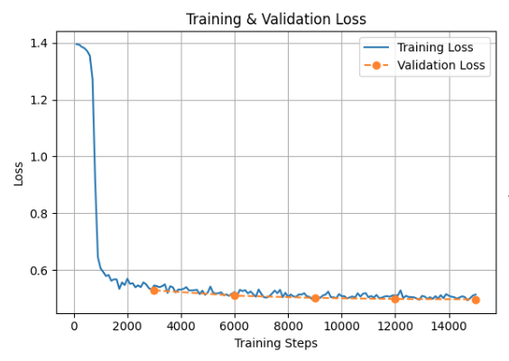
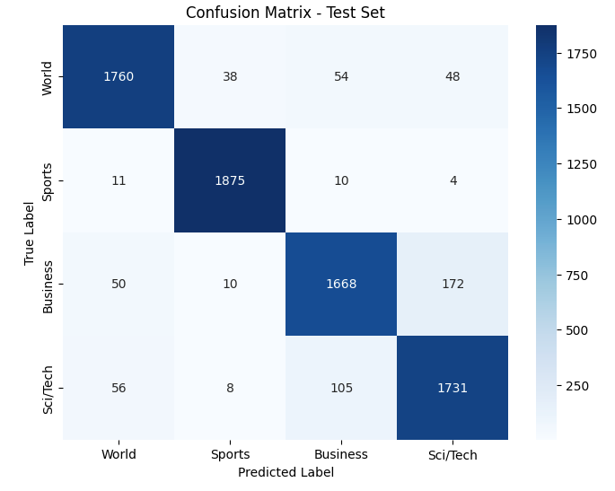

# Finetuning with LoRA

## Team Members

- **Akshat Singh** (as20255)  
- **Rishabh Budhouliya** (rb5727)  
- **Samprith Kalakata** (srk9068)

---

## Experiment

In this project, we utilize the **RoBERTa-base** model as the foundation, aiming to categorize news articles into one of four predefined classes:

- **World**
- **Sports**
- **Business**
- **Sci/Tech**

To adapt this model for the task under strict parameter efficiency constraints, we employ **Low-Rank Adaptation (LoRA)**.

---

## Objective

The main challenge was to **adhere to a total number of trainable parameters strictly below 1 million**. Given this constraint, we experimented with a combination of:

- Choice of **target modules** for adaptation
- **Rank (r)** of the low-rank matrices
- **Scaling factor (alpha)**
- Optimized **training hyperparameters**
- Mild **data augmentation**

---

## Methodology

Our methodology followed a structured, iterative process:

1. **Baseline Setup**:
   - Load and tokenize the AGNews dataset.
   - Fine-tune RoBERTa-base with default LoRA setup.

2. **Error Analysis**:
   - Identify class-level accuracy breakdown.
   - Discover confusion between **Business ↔ Sci/Tech**, and other inter-class misclassifications.
   - Analyze the impact of input **text length** and **model confidence gap**.

3. **LoRA Strategy Refinement**:
   - Prioritize higher-order transformer blocks for LoRA injection.
   - Optimize hyperparameters (learning rate, batch size, number of epochs).
   - Perform **light augmentation** to balance short and long texts.

---

## Results

### Final Accuracy

We achieved a final accuracy of **85.1%** on the test set under the 1M parameter constraint.

### Observations

- **Class 'Business'** had the highest misclassification rate (~13.16%).
- Most confusion occurred with the **'Sci/Tech'** class.
- Instances with **shorter text lengths** correlated with higher prediction errors.
- Confidence gap between correct vs incorrect predictions was **0.1786**, showing that the model often "hesitates" during errors.

---

## Loss Curve

_This section visualizes the training and validation loss across epochs._

**Loss Curve Plot:**

---

## Confusion Matrix

_This section shows the confusion matrix of predicted vs. true labels._

**Confusion Matrix:**

---
